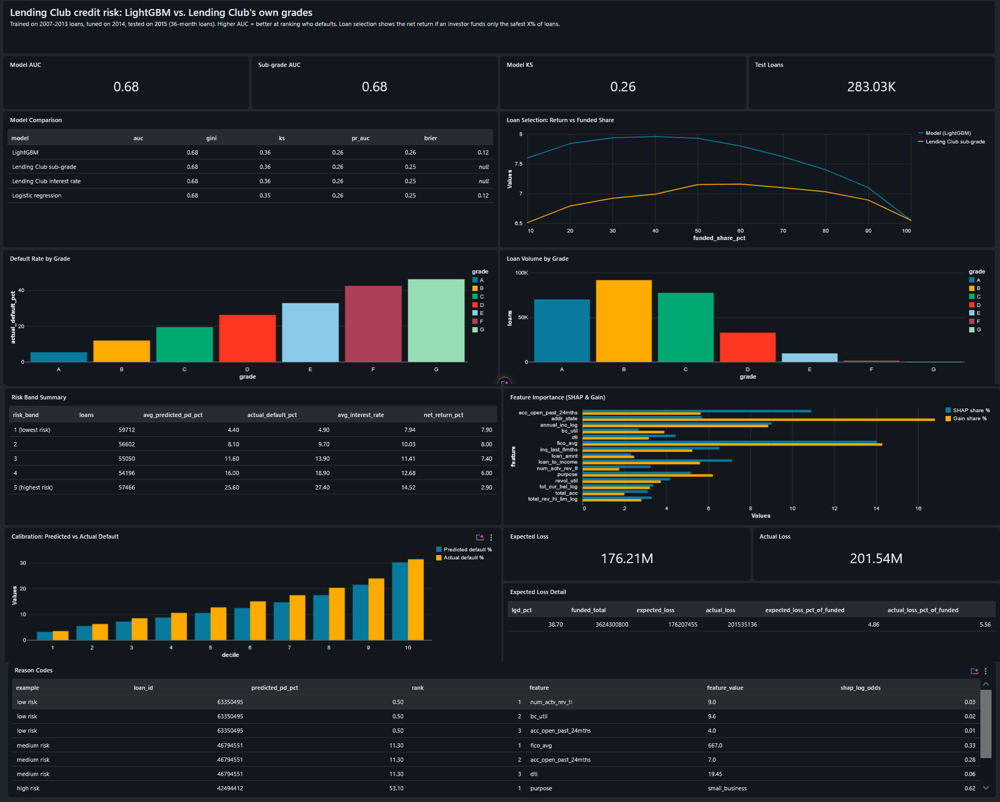
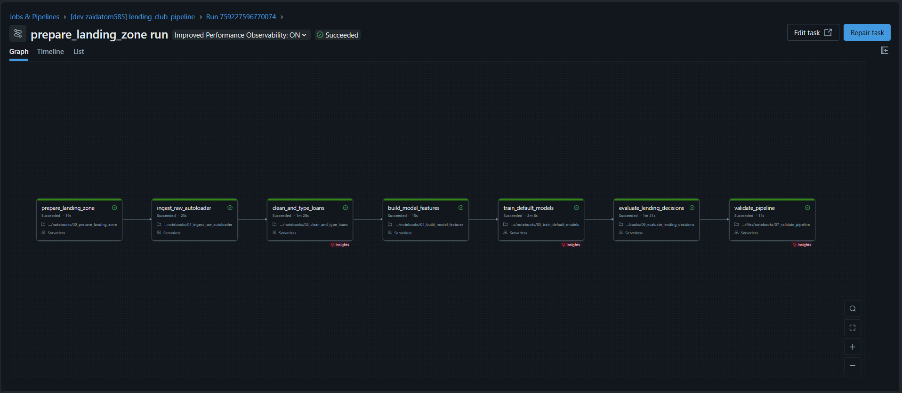

# Lending Club Credit Risk: Default Prediction and Loan Selection on Databricks

An end-to-end credit risk project on **Databricks**. The pipeline ingests 2.26 million Lending Club loans and 27.6
million rejected applications into a Delta Lake lakehouse, cleans and validates the data, trains default-probability
models tracked in MLflow, and compares the model's loan selection against Lending Club's own A1–G5 sub-grades.

**Result:** on 2015 loans the model never saw, LightGBM ranks risk slightly better than Lending Club's sub-grades
(AUC **0.682 vs 0.679**). That small edge turns into about **1 extra point of net return** when funding the safest
10–40% of loans.



---

## Results (2015 test year: 283,026 loans)

| Model | AUC | Gini | KS | PR AUC | Brier |
|---|---|---|---|---|---|
| **LightGBM** | **0.6823** | **0.3646** | **0.2647** | **0.2603** | 0.1203 |
| Lending Club sub-grade | 0.6787 | 0.3573 | 0.2619 | 0.2507 | – |
| Lending Club interest rate | 0.6784 | 0.3569 | 0.2621 | 0.2526 | – |
| Logistic regression | 0.6756 | 0.3512 | 0.2550 | 0.2533 | 0.1210 |

The sub-grade is the output of Lending Club's own underwriting model, so it's a strong benchmark. My models use only
what the borrower's application showed at the time, and never see the grade or the interest rate.

### Funding the safest X% of loans

| Funded | Default rate: model | Default rate: sub-grade | Net return: model | Net return: sub-grade | Advantage |
|---|---|---|---|---|---|
| 10% | 3.43% | 3.64% | 7.60% | 6.51% | **+1.09 pts** |
| 20% | 4.81% | 4.91% | 7.84% | 6.79% | **+1.05 pts** |
| 30% | 6.02% | 6.06% | 7.94% | 6.92% | **+1.02 pts** |
| 40% | 7.14% | 7.22% | 7.96% | 6.99% | **+0.97 pts** |
| 50% | 8.24% | 8.26% | 7.93% | 7.15% | +0.78 pts |
| 100% | 14.89% | 14.89% | 6.55% | 6.55% | 0 |

The default rates are almost the same, but the returns are not. Picking by sub-grade means picking **A1, A2, …** first,
which are the loans with the lowest interest rates. The model finds loans that are just as safe but are graded (and so priced)
lower, so they pay more interest for the same risk. Net return = total repaid ÷ amount funded − 1, over the life of the
loan (not annualized).

### Other findings

- **Risk bands.** I split the 2015 loans into five equal bands using cut-offs set on 2014. Actual default rates rise
  steadily: **4.9% → 9.7% → 13.9% → 18.9% → 27.4%**. The riskiest band charges 14.5% interest on average, but its
  net return is only **2.9%**, against 7.9% for the safest band. The higher rate doesn't pay for the extra defaults.
- **Expected loss** (PD × LGD × EAD). Loss given default, estimated from 2007–2013 defaults, is **38.7%**. The
  model expected **$176.2M** of losses on $3.62B funded (4.86%); the actual loss was **$201.5M** (5.56%).
- **Calibration drift.** The model under-predicts defaults in every decile, by 0.3 to 2.9 points. Defaults rose from
  12.6% in the training years to 13.7% in 2014 and 14.9% in 2015. The model still ranks well (that's what AUC
  measures), but its probability level is too low. Recalibrating on recent data is the fix (see *Next steps*).
- **Gain importance was misleading.** By LightGBM's built-in gain, `addr_state` was the top feature (16.8%). SHAP
  values, which measure how much each feature actually moves each prediction, put it at **5.7%**. A 50-level category
  gets many split opportunities, which inflates gain. By SHAP, the real drivers are FICO score (14.0%), accounts opened in the
  last 24 months (10.9%), income (9.0%), and loan-to-income (7.1%).
- **Reason codes.** For each loan, the top SHAP contributions explain the score. For example, the high-risk loan
  (53% predicted default) was driven by *purpose = small_business*, a loan worth 48% of annual income, and a FICO of 662.

---

## Pipeline



A Databricks job runs seven notebooks in order on serverless compute. The whole run takes about 6½ minutes.

| # | Notebook | What it does | Output |
|---|---|---|---|
| 00 | `prepare_landing_zone` | Creates the schema and volumes, and sorts the raw files into landing folders | volumes |
| 01 | `ingest_raw_autoloader` | Auto Loader (incremental, checkpointed) reads the raw CSVs as strings | `bronze_accepted` (2,260,701), `bronze_rejected` (27,648,741) |
| 02 | `clean_and_type_loans` | Type-safe casts, the default target, derived ratios, and a data quality log. Outcome columns go to a separate table | `silver_loans`, `silver_loan_outcomes`, `silver_rejected`, `silver_dq_log` |
| 03 | `explore_default_drivers` | Exploration in SQL: vintages, grades, FICO, DTI, purpose (run by hand, not part of the job) | – |
| 04 | `build_model_features` | Selects the modeling cohort and builds features and the time split | `gold_features` (621,022) |
| 05 | `train_default_models` | Logistic regression and LightGBM, tracked in MLflow; the model is registered in Unity Catalog | `gold_model_comparison`, `gold_predictions`, … |
| 06 | `evaluate_lending_decisions` | Calibration, risk bands, loan selection, expected loss, SHAP, reason codes | `gold_calibration`, `gold_risk_bands`, … |
| 07 | `validate_pipeline` | 14 checks; the job fails if any check fails | – |
| 08 | `export_results` | Writes the summary tables to CSV for [`results/`](results) (run by hand) | CSVs |

**Modeling cohort.** I kept only 36-month loans issued 2007–2015 that have a final outcome (fully paid or charged
off). A 36-month loan issued in 2015 reaches its scheduled end by the last date in the data (Q4 2018), so this cohort's outcomes are close to complete. I left out
60-month loans and later vintages, because many of those were still running and would make default look rarer than it is.

| Split | Years | Loans | Default rate |
|---|---|---|---|
| Train | 2007–2013 | 175,426 | 12.63% |
| Validation (early stopping, band cut-offs) | 2014 | 162,570 | 13.73% |
| Test (touched once) | 2015 | 283,026 | 14.89% |

**Features (30).** These include FICO, income (log), DTI, loan-to-income, utilization, inquiries, delinquency history,
account counts, credit history length, employment length, home ownership, verification status, purpose, and state.

### Quality checks (`07_validate_pipeline`)
The checks cover row counts, unique loan IDs, valid targets, and no outcome columns in silver. On the gold side they
check that the cohort matches, the years are in order, and no leakage columns are present. On the model side they
check one prediction per loan, probabilities between 0 and 1, and that the test AUC is between 0.60 and 0.80. **An AUC
that's too high fails the build**, because in credit risk that almost always means leakage. The last check confirms the
model is no worse than the sub-grade benchmark.

---

## Problems I ran into

**Columns that give away the answer.** The dataset includes columns that are only known *after* a loan is issued:
total payments, recoveries, the borrower's latest FICO score, and so on. A model with those columns looks brilliant
and is useless. I built an allowlist of fields available at application time and moved the outcome fields to a separate
`silver_loan_outcomes` table. Only the evaluation step reads that table (for returns and loss given default). I also
dropped `installment`. It looks harmless, but it's calculated from the interest rate, and the interest rate encodes
Lending Club's grade.

**Lending Club's grade as a benchmark, not an input.** The grade and interest rate are Lending Club's own risk
judgement. If I fed them to the model, I'd mostly be copying their answer. I kept them out of the features and used
them only as the benchmark to beat.

**A random split would have flattered the model.** Shuffling loans from different years into train and test lets the
model learn from the "future". I split by year instead (train on 2007–2013, test on 2015). That's also how the drift
showed up: the calibration gap only appears because the test year really is later.

**Messy CSVs.** The loan descriptions contain quotes and line breaks, so I read the files with multi-line and escape
options set, and kept every column as a string in bronze. The file also has 33 summary rows (like "Total amount funded
in policy code…") mixed in with the loans. Serverless runs Spark with ANSI mode on, so one bad value such as `n/a` in a
number column would fail the whole cast. I used `try_cast`, `try_to_timestamp`, and `try_divide` throughout, and logged what
was removed in `silver_dq_log`.

**MLflow on serverless.** Logging the scikit-learn pipeline failed because the default `skops` format rejected NumPy
types as "untrusted". I switched that model to the cloudpickle format. Installing MLflow with `%pip` upgraded
packages the runtime depends on, so I installed only what was missing (`lightgbm`, `skops`). Registering a model also
failed with `CONFIG_NOT_AVAILABLE` when I ran the notebook from VS Code, but it worked in the browser and in the
scheduled job. The difference is the execution environment, not the code.

**Renaming notebooks broke the bundle.** I renamed the notebooks to describe what each one does. One file was saved as
`07_quality checks.py` (with a space), so the job definition pointed at a file that didn't exist. The bundle then
failed validation, and VS Code silently lost its sync target. I fixed the file name and the bundle validated again.

**Windows details.** PowerShell's default file encoding adds a byte-order mark, which stops Databricks recognizing
`# Databricks notebook source` on the first line, so I wrote files as UTF-8 without a BOM. I kept the raw data on a
separate drive and out of Git (see `.gitignore`).

---

## Next steps

- **Recalibrate** the probabilities on 2014 data (isotonic or Platt scaling), so the expected loss matches the actual loss more closely.
- Drop `application_type`. Every training loan is an individual application, so it carries no signal (zero importance).
- Add 60-month loans as a separate model.
- Use the 27.6M rejected applications for reject inference (the model only ever sees loans that were approved).

---

## Run it yourself

**You need:** a [Databricks Free Edition](https://www.databricks.com/learn/free-edition) workspace, the
[Databricks CLI](https://docs.databricks.com/dev-tools/cli/install.html), and the
[Kaggle CLI](https://github.com/Kaggle/kaggle-api).

```powershell
git clone https://github.com/zaidatom585/Lending-Club-Credit-Risk.git
cd Lending-Club-Credit-Risk
databricks auth login --host https://<your-workspace>.cloud.databricks.com

# 1. Get the data (large; it stays out of the repo).
kaggle datasets download -d wordsforthewise/lending-club -p data

# 2. Deploy the job, then run 00 once. It creates the schema and volumes and tells you where to upload.
databricks bundle deploy
databricks fs cp data/lending-club.zip dbfs:/Volumes/workspace/lending_club/raw/

# 3. Run the full pipeline.
databricks bundle run lending_club_pipeline
```

To see the dashboard, import [`dashboards/lending_club_credit_risk.lvdash.json`](dashboards) from **Dashboards →
Import**. The workspace host in `databricks.yml` is mine; change it to yours.

```
├── databricks.yml                 # bundle definition
├── resources/
│   └── lending_club_pipeline.job.yml
├── notebooks/                     # 00–08, Databricks source format
├── dashboards/                    # AI/BI dashboard definition
├── results/                       # exported summary tables (CSV)
└── images/
```

## Tech stack
Databricks (serverless, Unity Catalog, Volumes, Auto Loader, Delta Lake, Jobs, Asset Bundles, AI/BI Dashboards) ·
PySpark · Spark SQL · MLflow · LightGBM · scikit-learn · SHAP · pandas

**Data:** [Lending Club loan data](https://www.kaggle.com/datasets/wordsforthewise/lending-club) (2007–2018), via Kaggle.
The raw data is not included in this repo.

## License
MIT
